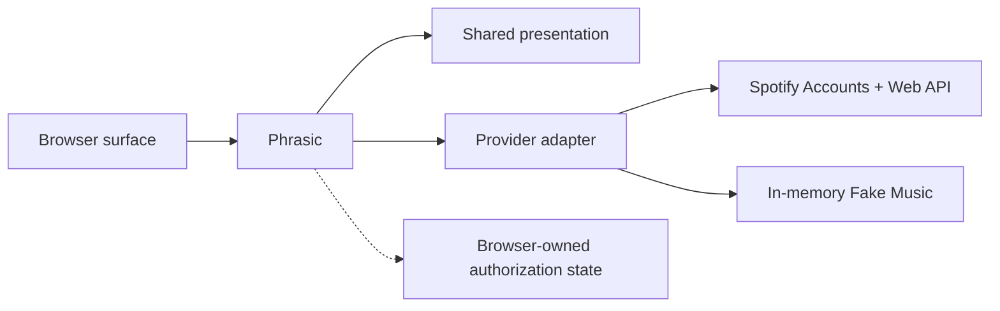

<div align="center">


# Phrasic

**A provider-neutral, browser-based now-playing display.**

Turn live playback metadata into a polished, responsive visual with artwork,
attribution, long-text motion, and resilient connection states—without an
application server.

<p>
  
  
  
  
</p>

[Providers](#providers) · [Quick start](#quick-start) ·
[Use the display](#use-the-display) · [Develop offline](#develop-offline)

</div>

<p align="center">
  
</p>

<p align="center">
  <sub>Recorded with the bundled Fake Music provider—no account or external service required.</sub>
</p>

## What Phrasic does

|                                       |                                                                                                                                                    |
| ------------------------------------- | -------------------------------------------------------------------------------------------------------------------------------------------------- |
| 🎵 **Provider-aware presentation**    | Applies each provider's identity, attribution, destinations, authorization language, and display policy without leaking one provider into another. |
| 📀 **Tracks and episodes**            | Presents artwork and linked item, creator, collection, show, and publisher metadata where the provider supplies it.                                |
| 📐 **Responsive by default**          | Scales from `320` through `7680` pixels with content-aware sizing, long-text motion, and proportional artwork.                                     |
| 🔄 **Honest connection states**       | Shows authorization, empty, unsupported, reconnecting, stale-content, failure, and fatal states rather than an ambiguous blank surface.            |
| 🔒 **Browser-owned authorization**    | Keeps credentials in the browser profile. There is no application server, client secret, playback history, or audio rebroadcasting.                |
| ♿ **Accessible motion and controls** | Includes semantic status updates, keyboard-operable setup controls, and reduced-motion behavior.                                                   |

## Providers

| Provider       | Route       | Intended use     | Authorization and data                                                                                       |
| -------------- | ----------- | ---------------- | ------------------------------------------------------------------------------------------------------------ |
| **Spotify**    | `/spotify/` | Live playback    | Browser-based PKCE; displays Spotify tracks and podcast episodes with required attribution and destinations. |
| **Fake Music** | `/fake/`    | Development/demo | Memory-only authorization and playback controlled by same-window messages; no storage or network calls.      |

Fake Music is enabled by the development server and disabled by default in the
Caddy deployment. Set `FAKE_PROVIDER_ENABLED=true` only where the testing route
should be public.

## How it works



Each entry loads only its provider-specific composition and worker. Spotify's
PKCE, storage, API calls, branding, and policy stay isolated from Fake Music;
the fake entry contains no Spotify configuration, authentication, text, logo,
or links.

## Quick start

### Requirements

- A public HTTPS origin.
- A [Spotify Developer](https://developer.spotify.com/dashboard) application.
- Docker for the packaged deployment.

### 1. Configure Spotify

Register the exact callback in the Spotify Dashboard:

```text
https://display.example/spotify/
```

Create a deployment-specific `config.json`:

```json
{
  "spotify": {
    "clientId": "public-client-id",
    "redirectUri": "https://display.example/spotify/"
  }
}
```

The `/spotify/` path and trailing slash must match exactly. Do not add a client
secret, tokens, query string, fragment, or additional fields.

### 2. Run the published image

```sh
docker pull alsilawr/phrasic:2.0.0

docker run --rm --publish 127.0.0.1:8080:8080 \
  --mount type=bind,src="$(pwd)/config.json",dst=/srv/config.json,readonly \
  alsilawr/phrasic:2.0.0
```

The container serves the production build through Caddy on loopback port
`8080`. Release tags publish versioned, major/minor, major, and `latest`
multi-platform images for AMD64 and ARM64.

### 3. Put it behind HTTPS

Proxy the container through the TLS-owning server for the public origin. For an
outer Caddy instance:

```caddyfile
display.example {
  reverse_proxy 127.0.0.1:8080
}
```

The bundled Caddyfile owns static files, caching, and security headers. Other
static hosts and CDNs must reproduce the
[static-host response header contract](deploy/static-host-headers.md).

## Use the display

Open or embed the setup URL in any browser surface:

```text
https://display.example/spotify/?width=1920&setup=1
```

Select **Connect Spotify**, complete authorization in that browser profile,
then use the clean display URL:

```text
https://display.example/spotify/?width=1920
```

Phrasic is ordinary transparent web content. It can run in a browser window,
web view, signage surface, stream compositor, or browser-source implementation.
When the host offers an interaction mode—such as OBS Browser Source's
**Interact** command—use it while `setup=1` is present.

### Display options

| Parameter | Purpose                                                               | Accepted value                         |
| --------- | --------------------------------------------------------------------- | -------------------------------------- |
| `width`   | Matches the rendered display to its host surface. Defaults to `1920`. | One integer from `320` through `7680`. |
| `setup`   | Shows reconnect, retry, and disconnect controls.                      | `1`                                    |

Malformed, repeated, unsupported, or out-of-range parameters show an in-display
diagnostic and fall back to a safe configuration.

## Develop offline

Phrasic requires Node.js 26 and npm 12.

```sh
npm ci
npm run dev
```

Open `http://localhost:5173/fake/`, select **Connect Fake Music**, and drive the
memory-only provider from the browser console. The
[Fake Music integration reference](docs/fake-music-integration.md) contains the
control schema, lifecycle, examples, and deployment gate.

Regenerate the README demonstration from start to finish with:

```sh
docs/generate-fake-music-flow.sh
```

The harness builds Phrasic, launches a local preview and isolated headless
Chrome, drives a realistic authorization and playback flow, records native
transparency at 24 fps, and replaces `docs/fake-music-flow.webp`.

## Troubleshooting

| Symptom                               | What to check                                                                                                             |
| ------------------------------------- | ------------------------------------------------------------------------------------------------------------------------- |
| Spotify rejects the callback          | Register the exact HTTPS callback, match `redirectUri` in `/config.json`, and retain `/spotify/` with its trailing slash. |
| Provider configuration is unavailable | Serve the exact two-field `/config.json` as JSON, disable caching for it, and remove extra fields.                        |
| Spotify access was revoked            | Open `?setup=1`, disconnect, then connect and approve Spotify again.                                                      |
| Nothing is playing                    | Start a Spotify track or episode. Phrasic displays metadata; it does not play audio.                                      |
| The current item is unsupported       | The Spotify provider currently displays tracks and podcast episodes.                                                      |
| A width diagnostic appears            | Supply one integer `width` from `320` through `7680`; use `setup=1` only when controls are needed.                        |

## Security and Spotify display policy

Spotify authorization uses PKCE and keeps refresh material separate from the
playback worker. Phrasic attributes Spotify with its full logo; metadata and
Spotify-provided artwork link to the applicable Spotify content. Artwork keeps
its original aspect ratio and is not cropped, overlaid, recolored, blurred,
distorted, or persisted.

Do not use the Spotify provider to present Spotify metadata or artwork as a
standalone service, and do not redistribute Spotify audio. Read the repository's
[Spotify display policy](docs/spotify-display-policy.md) alongside the
[Spotify Developer Policy](https://developer.spotify.com/policy) and
[Spotify Design & Branding Guidelines](https://developer.spotify.com/documentation/design).

## Version 2 boundary

Version 2 has no version 1 migration. Deploy the current static `dist/` output,
provide the current `/config.json`, and authorize again for every deployed
origin and browser profile.
