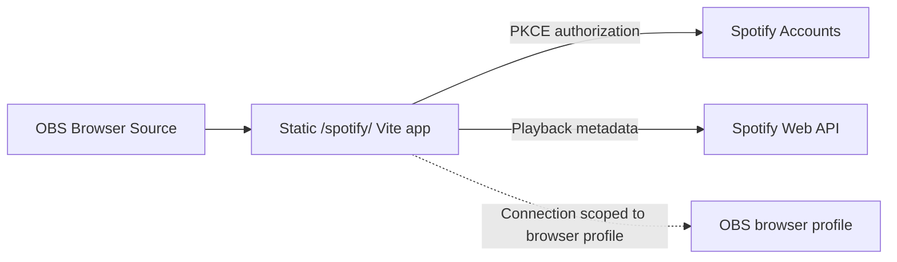

<div align="center">

# Spotify Now Playing for OBS

**A polished, responsive now-playing overlay built specifically for OBS Browser Sources.**

Display the current Spotify track or podcast episode—with artwork, attribution,
responsive typography, reconnecting states, and no application server.

<p>
  
  
  
  
</p>

[Features](#features) · [Quick start](#quick-start) ·
[Add to OBS](#add-it-to-obs) · [Fake Music](#develop-and-demo-offline)

</div>

<p align="center">
  
</p>

<p align="center">
  <sub>The demonstration uses the bundled Fake Music provider, so it requires no Spotify account or external network access.</sub>
</p>

## Features

|                                         |                                                                                                                                                            |
| --------------------------------------- | ---------------------------------------------------------------------------------------------------------------------------------------------------------- |
| 🎙️ **Made for OBS**                     | A clean Browser Source overlay whose broadcast URL hides maintenance controls after connection.                                                            |
| 🔒 **Private by design**                | Spotify PKCE runs in the browser. There is no application server, client secret, database, playback history, or audio rebroadcasting.                      |
| 🎵 **Tracks and episodes**              | Displays Spotify tracks and podcast episodes with linked metadata, artwork, and required Spotify attribution.                                              |
| 📐 **Responsive presentation**          | Supports Browser Source widths from `320` through `7680`, content-aware sizing, long-text motion, and proportional artwork.                                |
| 🔄 **Resilient playback states**        | Presents authorization, empty, unsupported, reconnecting, stale-content, and failure states without leaving an ambiguous blank source.                     |
| ♿ **Broadcast-friendly accessibility** | Includes semantic status updates, keyboard-operable setup controls, and reduced-motion behavior.                                                           |
| 🧪 **Offline visual testing**           | Ships a memory-only Fake Music integration for repeatable authorization, playback, failure, and presentation demonstrations. Disabled in Caddy by default. |

## How it works



The client ID and redirect URI are public configuration. Authorization state
belongs to the deployed origin and the OBS browser profile that completed the
connection.

## Quick start

### What you need

- A public HTTPS origin for the overlay.
- A [Spotify Developer](https://developer.spotify.com/dashboard) application.
- Docker for the packaged deployment.

### 1. Configure Spotify

Register the exact production callback in the Spotify Dashboard:

```text
https://overlay.example/spotify/
```

Create a deployment-specific `config.json`:

```json
{
  "spotify": {
    "clientId": "public-client-id",
    "redirectUri": "https://overlay.example/spotify/"
  }
}
```

The `/spotify/` path and trailing slash must match exactly. Do not add a client
secret, tokens, query string, fragment, or additional fields.

### 2. Build and run

```sh
docker build -t obs-nowplaying .

docker run --rm --publish 127.0.0.1:8080:8080 \
  --mount type=bind,src="$(pwd)/config.json",dst=/srv/config.json,readonly \
  obs-nowplaying
```

The container serves the static production build through Caddy and binds to
loopback port `8080`.

### 3. Put it behind HTTPS

Proxy the container through the TLS-owning server for your public origin. For
an outer Caddy instance:

```caddyfile
overlay.example {
  reverse_proxy 127.0.0.1:8080
}
```

The bundled Caddyfile owns static files, caching, and security headers. Other
static hosts and CDNs must reproduce the
[static-host response header contract](deploy/static-host-headers.md).

## Add it to OBS

1. Add a **Browser Source** with this setup URL, replacing the origin:

   ```text
   https://overlay.example/spotify/?width=1920&setup=1
   ```

2. Set the OBS source width to match the URL width.
3. Right-click the source, choose **Interact**, and select **Connect Spotify**.
4. Complete Spotify authorization in that Browser Source's browser profile.
5. Remove `&setup=1` for the clean broadcast URL:

   ```text
   https://overlay.example/spotify/?width=1920
   ```

To reconnect or disconnect later, temporarily restore `setup=1` and use
**Interact**.

## Display options

| Parameter | Purpose                                                                           | Accepted value                         |
| --------- | --------------------------------------------------------------------------------- | -------------------------------------- |
| `width`   | Matches the rendered overlay to the OBS Browser Source width. Defaults to `1920`. | One integer from `320` through `7680`. |
| `setup`   | Shows reconnect, retry, and disconnect controls when interaction is needed.       | `1`                                    |

Malformed, repeated, unsupported, or out-of-range parameters show an in-overlay
diagnostic and fall back to a safe display configuration.

## Develop and demo offline

This project requires Node.js 26 and npm 12.

```sh
npm ci
npm run dev
```

Open `http://localhost:5173/fake/` to use the shipped Fake Music integration.
It exercises the complete overlay without Spotify configuration or
authentication, persistent storage, Spotify branding, or API traffic.

Regenerate the README demonstration from start to finish with:

```sh
docs/generate-fake-music-flow.sh
```

The harness builds the app, launches a local preview and isolated headless
Chrome, drives the demonstration, records native transparency at 24 fps, and
replaces `docs/fake-music-flow.webp`. See the
[Fake Music integration reference](docs/fake-music-integration.md) for its
control protocol and deployment gate.

## Troubleshooting

| Symptom                                                | What to check                                                                                                             |
| ------------------------------------------------------ | ------------------------------------------------------------------------------------------------------------------------- |
| Spotify rejects the callback or does not return to OBS | Register the exact HTTPS callback, match `redirectUri` in `/config.json`, and retain `/spotify/` with its trailing slash. |
| The overlay reports unavailable configuration          | Serve the exact two-field `/config.json` as JSON, disable caching for it, and remove extra fields.                        |
| Spotify access was revoked                             | Open `?setup=1` through **Interact**, disconnect, then connect and approve Spotify again.                                 |
| Nothing is playing                                     | Start a Spotify track or episode. The overlay displays metadata; it does not play audio.                                  |
| The current item is unsupported                        | Only Spotify tracks and podcast episodes are displayable.                                                                 |
| A width diagnostic appears                             | Supply one integer `width` from `320` through `7680`; use `setup=1` only once.                                            |

## Security and Spotify display policy

The overlay attributes Spotify with its full Spotify logo. Metadata and
Spotify-provided artwork link to the applicable Spotify content. Artwork keeps
its original aspect ratio and is not cropped, overlaid, recolored, blurred,
distorted, or persisted.

Do not use the overlay to present Spotify metadata or artwork as a standalone
service, and do not redistribute Spotify audio. Read the repository's
[Spotify display policy](docs/spotify-display-policy.md) alongside the
[Spotify Developer Policy](https://developer.spotify.com/policy) and
[Spotify Design & Branding Guidelines](https://developer.spotify.com/documentation/design).

## Version 2 boundary

Version 2 has no version 1 migration. Deploy the current static `dist/` output,
provide the current `/config.json`, and authorize again for every deployed
origin and browser profile.
